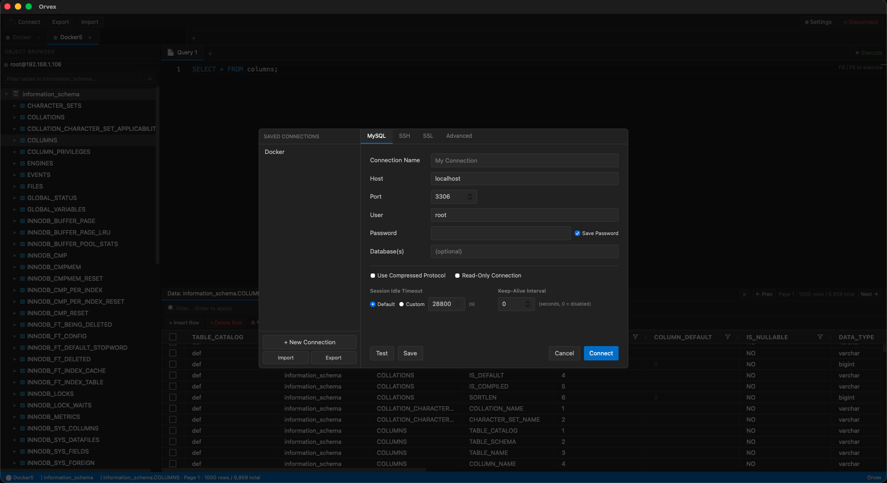
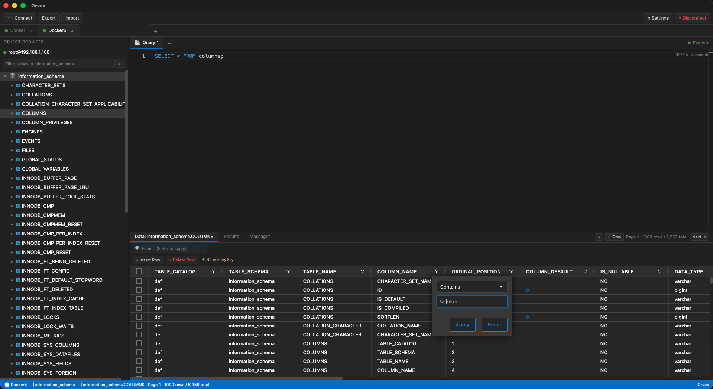

# Orvex

A fast, native MySQL client for developers who want a clean, distraction-free tool to connect, explore, and query their databases — without the bloat.

Built with [Tauri 2](https://tauri.app) (Rust + WebView), so it's small, fast, and feels like a real desktop app.

## Screenshots





## Features

- **Multiple sessions** — open several connections at once, each in its own tab with independent state
- **SSH tunnel support** — connect to remote databases via SSH with password or private key auth
- **SQL editor** — full syntax highlighting and multi-tab editing powered by Monaco Editor
- **Object browser** — navigate databases, tables, views, and columns; click a table to preview its data instantly
- **Data grid** — browse and filter table data with pagination, column chips, and inline search
- **Table structure** — inspect column definitions, indexes, and foreign keys from a dedicated tab
- **Export** — dump query results or full tables to SQL, CSV, or JSON
- **Import** — load SQL files with chunked execution and real-time progress
- **Persistent settings** — configure query limits, display preferences, export behavior, and more

## Tech Stack

| Layer | Technology |
|---|---|
| Framework | [Tauri 2](https://tauri.app) |
| Frontend | [React 19](https://react.dev) + TypeScript |
| State | [Zustand](https://zustand-demo.pmnd.rs) |
| Editor | [Monaco Editor](https://microsoft.github.io/monaco-editor/) |
| Data grid | [AG Grid Community](https://www.ag-grid.com) |
| Database driver | [sqlx](https://github.com/launchbadge/sqlx) (MySQL) |
| SSH tunnels | [russh](https://github.com/warp-tech/russh) |

## Building from Source

### Prerequisites

- [Rust](https://rustup.rs/) (stable toolchain)
- [Node.js](https://nodejs.org/) 18+
- Platform-specific WebView — see [Tauri prerequisites](https://tauri.app/start/prerequisites/)

### Run

```bash
# Install frontend dependencies
npm install

# Start in development mode (hot reload)
npm run tauri dev

# Build a production bundle
npm run tauri build
```

## Platform Support

| Platform | Bundle format |
|---|---|
| macOS | `.dmg`, `.app` |
| Linux | `.AppImage`, `.deb` |
| Windows | `.msi`, `.exe` |

## License

MIT
